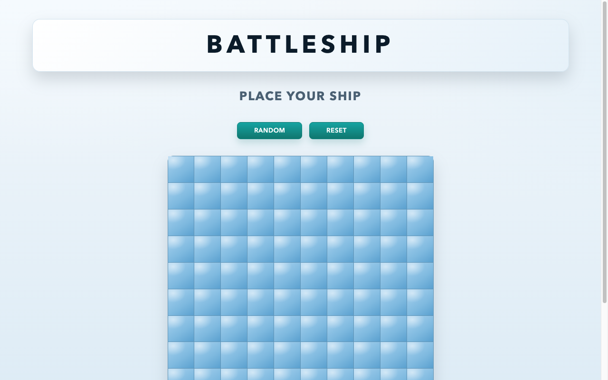

# Battleship

A test-driven, browser-based **Battleship** game built with vanilla JavaScript and
Webpack. The codebase deliberately separates game logic from DOM rendering so the rules
can be unit-tested with Jest, independent of the UI.

🔗 **Live demo:** [battleship-one-sandy.vercel.app](https://battleship-one-sandy.vercel.app/)



## Features

- Modular board, ship, player, ship-placement, and turn-flow logic.
- CPU "hunt" behavior for automated opponent turns.
- Dual-grid UI rendering for the player and computer boards.
- Manual and randomized ship placement.
- Jest coverage for core board and ship behavior.

## Tech stack

JavaScript · HTML · CSS · **Jest** (tests) · **Webpack** (bundling, dev server)

## Getting started

```bash
npm install
npm start        # webpack dev server (opens the browser)
```

Other scripts:

| Script | Description |
|---|---|
| `npm run build` | Production bundle (`webpack --mode production`) |
| `npm test` | Run the Jest test suite |
| `npm run lint` | ESLint |
| `npm run format` | Prettier |

## What I practiced

Separating **pure game logic from rendering** so the rules are unit-testable, writing a
simple CPU opponent, and driving development with tests (Jest) before wiring the DOM.

## License

Odin Project coursework — original implementation by Aziz Umarov.
